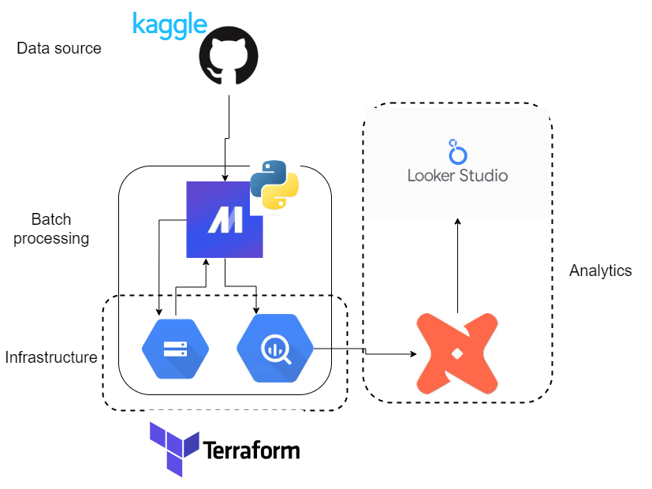

# Covid-19-impact-dashboard

Problem statement
Develop a dashboard with two tiles by (with my progress):

- [x] Selecting a dataset of interest
- [x] Creating a pipeline for processing this dataset and putting it to a datalake
- [x] Creating a pipeline for moving the data from the lake to a data warehouse
- [x] Transforming the data in the data warehouse: prepare it for the dashboard
- [x] Building a dashboard to visualize the data

### [The resulting covid dashboard](https://lookerstudio.google.com/reporting/b3fbe0b9-3c01-41e4-bac0-76368d3b529b)




## Table of Content


### Setting up VM

1. In terminal run
```bash
ssh-keygen -t ed25519 -f ~/.ssh/covid_project_gcp -C cncPomper -b 2048
```

> **_NOTE:_**  `cncPomper` becomes our profile name on later created VM

in order to generate ssh key pair

2. Add generated ssh key to GCP
    1. go to Settings > Metadata > Add ssh key
    2. add generated public key

3. Create VM instance
    1. Region <- europe
    2. Zone <- eurobe-b
    3. Machine type <- e2-standard-4 (4 vCPU, 16GB memory)
    4. Boot disk
        1. OS <- Ubuntu
        2. Version <- Ubuntu 20.04 LTS
        3. Size <- 50 GB

4. Connect to VM
    1. ssh VM
    ```bash
    ssh -i ~/.ssh/covid_project_gcp cncPomper@EXTERNAL_IP_ADDRESS_OF_VM
    ```

> **_NOTE:_**  To make our lives easier we could create a `Host` profile in `.ssh/config`
```
Host covid-project
    HostName EXTERNAL_IP_ADDRESS_OF_VM
    User cncPomper
    IdentityFile c:/Users/MS_USERNAME/.ssh/covid_project_gcp or ~/.ssh/covid_project_gcp if on linux
```

### Installing needed packages

1. Install Anaconda

```bash
wget https://repo.anaconda.com/archive/Anaconda3-2024.02-1-Linux-x86_64.sh
```

```bash
bash Anaconda3-2024.02-1-Linux-x86_64.sh
```

Run `.bashrc` (If you decided to run conda init during installation)
```bash
source .bashrc
```

1. Install docker

```bash
sudo apt-get update
```

```bash
sudo apt-get install docker.io
```

Follow <a href="https://github.com/sindresorhus/guides/blob/main/docker-without-sudo.md" target="_blank">this</a> instruction in order to run docker on VM without sudo permission

Test if docker installed succesfully
```bash
docker run hello-world
```

Now we need to setup docker compose
```bash
mkdir bin
cd bin
```

```bash
wget https://github.com/docker/compose/releases/download/v2.26.0/docker-compose-linux-x86_64 -O docker-compose
```

Now in `~/bin` folder we need to make the downloaded package executable

```bash
chmod +x docker-compose
```

Add `docker-compose` to PATH:
- add at the end of `.bashrc` file the following

```bash
export PATH="${HOME}/bin:${PATH}"
```

- 'refresh' `.bashrc` by running

```bash
source .bashrc
```

Now to check if everything works run
```bash
docker-compose version
```

To check running containers
```bash
docker ps
```

2. Install terraform

```bash
wget -O- https://apt.releases.hashicorp.com/gpg | sudo gpg --dearmor -o /usr/share/keyrings/hashicorp-archive-keyring.gpg
echo "deb [signed-by=/usr/share/keyrings/hashicorp-archive-keyring.gpg] https://apt.releases.hashicorp.com $(lsb_release -cs) main" | sudo tee /etc/apt/sources.list.d/hashicorp.list
sudo apt update && sudo apt install terraform
```

### Configuring GCP for terraform

1. Terraform setup
- Go to `IAM & Admin` > `Service Accounts`
- Click on the top button `CREATE SERVICE ACCOUNT`
    - name : covid-project
    - service account access :
        - `Cloud Storage` > `Storage Admin`
        - `BigQuery` > `BigQuery Admin`
        - `Compute Engine` > `Compute Admin`

- Go to `IAM & Admin` > `Service Accounts` > Service account you just created > `Manage keys`
    - Add key > Create new Json key (This will download the key on system)

- Create directory for GCP keys

```bash
mkdir keys
cd keys
```

- Put downloaded key to `keys` folder

### Terraform

1. Run

```bash
terraform init
```

```bash
terraform plan
```

Run to create resources in the cloud

```bash
terraform apply
```

Destroy resources configured by terraform

```bash
terraform destroy
```


### Download data
Probably the most convienent way of download this particular dataset is by manually downloading it from <a href="https://www.kaggle.com/datasets/sudalairajkumar/novel-corona-virus-2019-dataset" target="_blank">kaggle</a> and then:
- unzip in the `/data` directory

## The rest of the content

### [Processing data and putting it to datalake](./md/processing_and_putting_to_datalake.md)
### [Processing and putting data to data warehouse](./md/process_and_put_to_bg.md)
### [Processing data in dbt and analytics](./md/processing_in_dbt.md)


## Columns description

## Sources

I have used data from this <a href="https://www.kaggle.com/datasets/sudalairajkumar/novel-corona-virus-2019-dataset" target="_blank">dataset</a>