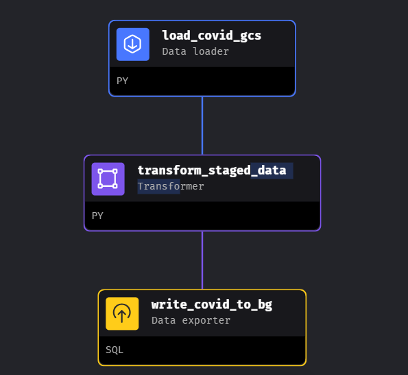
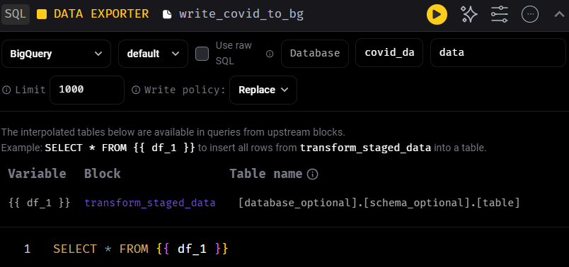

# MageAI pipeline view
- load data from google cloud storage, process and export to BigQuery

## To BigQuery



### load_covid_gcs.py
```python
from mage_ai.settings.repo import get_repo_path
from mage_ai.io.config import ConfigFileLoader
from mage_ai.io.google_cloud_storage import GoogleCloudStorage

import pyarrow as pa
import pyarrow.parquet as pq
import os

from os import path
if 'data_loader' not in globals():
    from mage_ai.data_preparation.decorators import data_loader
if 'test' not in globals():
    from mage_ai.data_preparation.decorators import test

os.environ['GOOGLE_APPLICATION_CREDENTIALS'] = "/path/to/key.json"

@data_loader
def load_from_google_cloud_storage(*args, **kwargs):

    bucket_name = 'project_name'
    object_key = 'covid_data'

    root_path = f"{bucket_name}/{object_key}"

    gcs = pa.fs.GcsFileSystem()
    df = pq.ParquetDataset(root_path, filesystem=gcs)
    df = df.read_pandas().to_pandas()
    return df

@test
def test_output(output, *args) -> None:
    """
    Template code for testing the output of the block.
    """
    assert output is not None, 'The output is undefined'

```

### transform_staged_data.py

```python
if 'transformer' not in globals():
    from mage_ai.data_preparation.decorators import transformer
if 'test' not in globals():
    from mage_ai.data_preparation.decorators import test

from collections import Counter

@transformer
def transform(data, *args, **kwargs):

    data.columns = (data.columns
                        .str.replace('/', ' ')
                        .str.replace(' ', '_')
                        .str.lower()
                        )

    return data

@test
def test_output(output, *args) -> None:
    assert output is not None, 'The output is undefined'
```

### write_covid_to_bg.py


