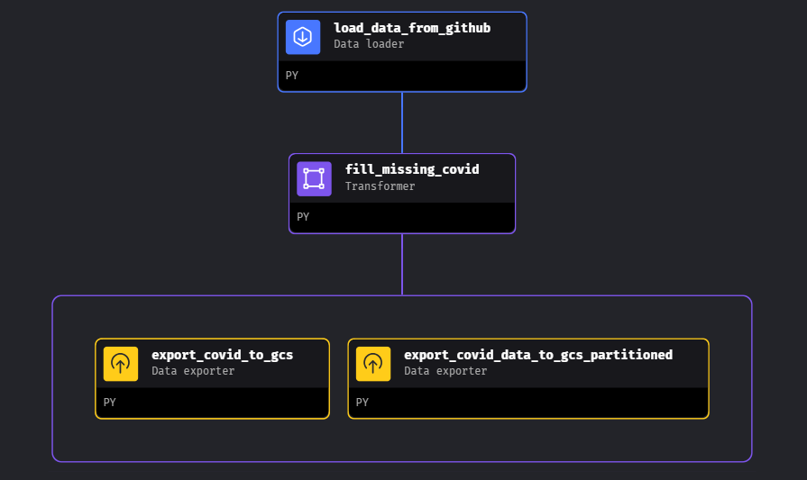

# Processing dataset and putting them in the data lake
## Technology used:
- [MageAI](https://docs.mage.ai/introduction/overview)
- [Apache Arrow](https://arrow.apache.org/docs/index.html)

<!-- 1. In the docker-compose.yml

Put the path to the GCP key in the `volumes` part
```bash
volumes:
      - .:/home/src/
      - /home/cncPomper/Covid-19-impact-dashboard/keys/terraform-covid-19-project.json
``` -->

1. Pull latest mage

```bash
docker pull mageai:latest
```

2. Run to build mage (It may take couple of minutes to build)

```bash
docker-compose build
```

3. Run to

```bash
docker-compose up
```

## Mage, Postgres and GCP configuration

If you already have managed to make the service account for Terraform there should be no need to redo those steps to configure GCP.
Now, go to `io_config.yml` and put the following at the end of the file

> **_NOTE:_**  The bellow configuration for `project-dev` profile isn't necessary if you don't intent to use postgres.

```bash
project-dev:
  # PostgresSQL
  POSTGRES_CONNECT_TIMEOUT: 10
  POSTGRES_DBNAME: "{{ env_var('POSTGRES_DBNAME') }}"
  POSTGRES_SCHEMA: "{{ env_var('POSTGRES_SCHEMA') }}"
  POSTGRES_USER: "{{ env_var('POSTGRES_USER') }}"
  POSTGRES_PASSWORD: "{{ env_var('POSTGRES_PASSWORD') }}"
  POSTGRES_HOST: "{{ env_var('POSTGRES_HOST') }}"
  POSTGRES_PORT: "{{ env_var('POSTGRES_PORT') }}"
```
This allows you to create a new profile called `project-dev` with postgres configuration taken from `.env` file.

Unfortunately, you need to copy paster the `/keys` folder to the `/mage` folder. I didn't manage to find a nice way of using the same file from parent directory so if you know how to do so, please let me know, thanks!

So put the following in the `io_config.yaml` in the mage in the `default` profile:

```bash
GOOGLE_SERVICE_ACC_KEY_FILEPATH: "/path/to/key.json"
```

And delete everything beside `GOOGLE_SERVICE_ACC_KEY_FILEPATH` in the google part

## MageAI pipeline view
- load data from github repository and export to google cloud storage

## To Google Cloud Storage



## load_data_from_github.py

```python
if 'transformer' not in globals():
    from mage_ai.data_preparation.decorators import transformer
if 'test' not in globals():
    from mage_ai.data_preparation.decorators import test

@transformer
def transform(data, *args, **kwargs):

    # Specify your transformation logic here
    print(f"Processing {len(data)} rows...")

    data = data.rename(columns={"Country/Region" : "Country"})

    data['Country'] = data['Country'].apply(
      lambda x: x
      .replace(' ', '_')
      .replace(',','')
      .replace('(','')
      .replace(')','')
      .replace("'",'')
    )

    return data

@test
def test_output(output, *args) -> None:
    assert output is not None, 'The output is undefined'
```

### fill_missing_covid.py

```python
if 'transformer' not in globals():
    from mage_ai.data_preparation.decorators import transformer
if 'test' not in globals():
    from mage_ai.data_preparation.decorators import test

from collections import Counter

@transformer
def transform(data, *args, **kwargs):

    data.columns = (data.columns
                        .str.replace('/', ' ')
                        .str.replace(' ', '_')
                        .str.lower()
                        )

    return data

@test
def test_output(output, *args) -> None:
    assert output is not None, 'The output is undefined'
```

### export_covid_data_to_gcs_partitioned.py
```python
from mage_ai.settings.repo import get_repo_path
from mage_ai.io.config import ConfigFileLoader
from mage_ai.io.google_cloud_storage import GoogleCloudStorage
from pandas import DataFrame
from os import path

if 'data_exporter' not in globals():
    from mage_ai.data_preparation.decorators import data_exporter


@data_exporter
def export_data_to_google_cloud_storage(df: DataFrame, **kwargs) -> None:

    config_path = path.join(get_repo_path(), 'io_config.yaml')
    config_profile = 'default'

    bucket_name = 'precise-rite-412717_235_project'
    object_key = 'covid_data.parquet'

    GoogleCloudStorage.with_config(ConfigFileLoader(config_path, config_profile)).export(
        df,
        bucket_name,
        object_key,
    )

```

# Result