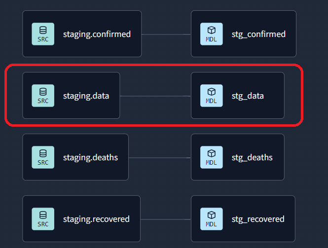

# DBT

## dbt configuration

After you created your account there are some steps to setup your project and alredy connect to BigQuery. Ther you put your gcp json key and then you test your connection with the data warehouse. I also connected my github account with dbt.



> **_NOTE:_**  Above you can see that there is some part of the graph circled in red. It's because at the end of the project I decided I didn't need more data sources since they had duplicate data as in the `stg.data` source. Hence, I didn't use the rest of the data sources.

```sql
with

    source as (select * from {{ source("staging", "data") }}),

    renamed as (

        select
            cast(sno as integer) as snoid,
            cast(observationdate as timestamp) as observation_date,
            {{"country"}},
            province_state,
            cast(confirmed as integer) as confirmed,
            cast(deaths as integer) as deaths,
            cast(recovered as integer) as recovered,

        from source

    )

select *
from renamed
```